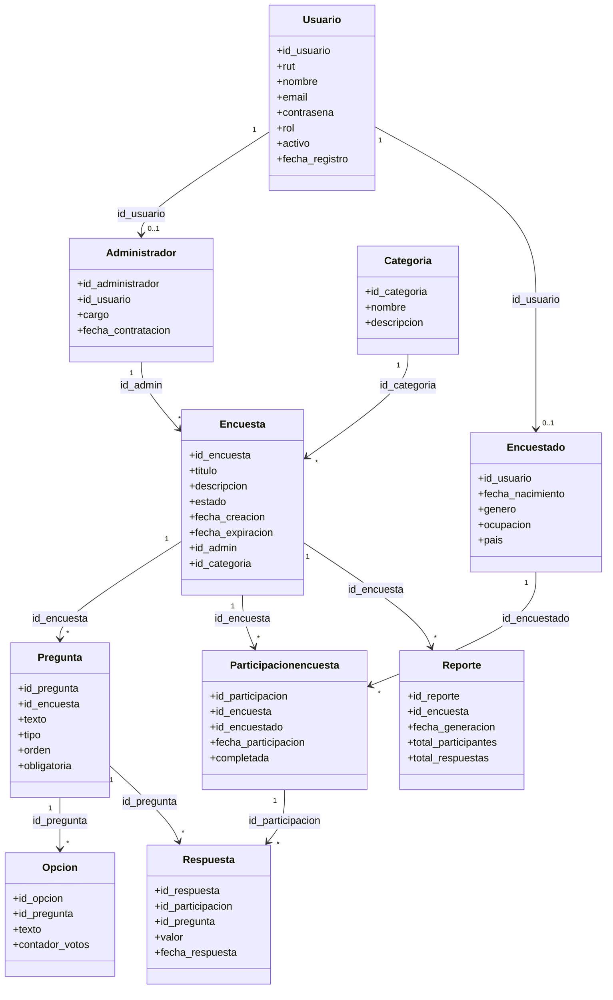

# Diagrama de clases

```mermaid
classDiagram
    class Usuario {
        +id_usuario
        +rut
        +nombre
        +email
        +contrasena
        +rol
        +activo
        +fecha_registro
    }

    class Administrador {
        +id_administrador
        +id_usuario
        +cargo
        +fecha_contratacion
    }

    class Encuestado {
        +id_usuario
        +fecha_nacimiento
        +genero
        +ocupacion
        +pais
    }

    class Categoria {
        +id_categoria
        +nombre
        +descripcion
    }

    class Encuesta {
        +id_encuesta
        +titulo
        +descripcion
        +estado
        +fecha_creacion
        +fecha_expiracion
        +id_admin
        +id_categoria
    }

    class Pregunta {
        +id_pregunta
        +id_encuesta
        +texto
        +tipo
        +orden
        +obligatoria
    }

    class Opcion {
        +id_opcion
        +id_pregunta
        +texto
        +contador_votos
    }

    class Participacionencuesta {
        +id_participacion
        +id_encuesta
        +id_encuestado
        +fecha_participacion
        +completada
    }

    class Respuesta {
        +id_respuesta
        +id_participacion
        +id_pregunta
        +valor
        +fecha_respuesta
    }

    class Reporte {
        +id_reporte
        +id_encuesta
        +fecha_generacion
        +total_participantes
        +total_respuestas
    }

    Usuario "1" --> "0..1" Administrador : id_usuario
    Usuario "1" --> "0..1" Encuestado : id_usuario
    Administrador "1" --> "*" Encuesta : id_admin
    Categoria "1" --> "*" Encuesta : id_categoria
    Encuesta "1" --> "*" Pregunta : id_encuesta
    Pregunta "1" --> "*" Opcion : id_pregunta
    Encuesta "1" --> "*" Participacionencuesta : id_encuesta
    Encuestado "1" --> "*" Participacionencuesta : id_encuestado
    Participacionencuesta "1" --> "*" Respuesta : id_participacion
    Pregunta "1" --> "*" Respuesta : id_pregunta
    Encuesta "1" --> "*" Reporte : id_encuesta
```
